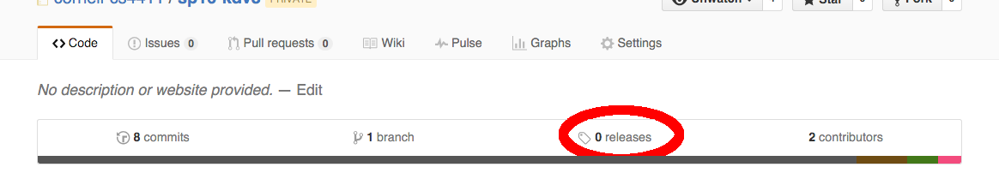
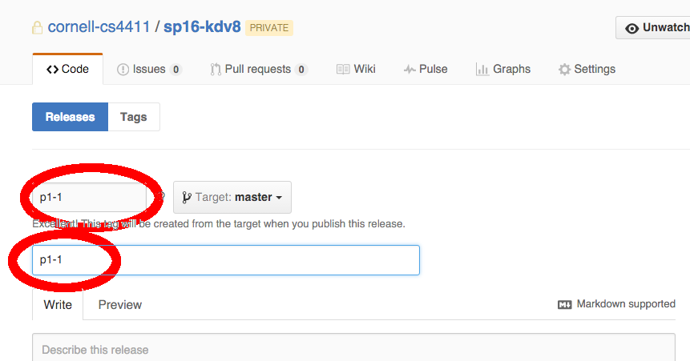

CS 4410 Operating Systems Spring 2016
___

MP 1: Synchronization
=====================

**Due**: Wednesday, March 2

Overview
--------

The `src` directory contains several several questions.  For each question,
please modify the corresponding qXX.py file to contain the required answers and
solutions.

When a textual answer is called for, write your answer as a comment, with the
exception of question 3.  Submit your answers to question 3 in the file
[src/q03-written.pdf](src/q03-written.pdf).
 
When a coding answer is called for, modify the skeletal code we have provided
to solve the problem, making sure your solution makes progress whenever it is
feasible to do so, and obeys the safety criteria described in the problem
description. 

Commandments
------------

All of your answers should follow the
[commandments of synchronization][commandments].

[commandments]: http://www.cs.cornell.edu/courses/cs4410/2012fa/papers/commandments.pdf

They should also guarantee safety, and make progress whenever it is possible to
do so.

The MP1 library
---------------

Instead of using python's built-in synchronization primitives, we are using the
primitives in the provided file [mp1.py](src/mp1.py).  These primitives provide helpful
debugging output for you, and support for autograding for us.  The documentation
for this library is included in the file [doc/mp1.md](doc/mp1.md).

**Your code must not use the python Thread, Semaphore, Lock, or Condition classes**.

Updates and Clarifications
--------------------------

Any updates to this assignment (e.g. bug fixes) will be announced in pinned
posts on [Piazza](https://piazza.com/class/ijzyq50bv5u3k6).  All non-pinned
posts should be considered non-binding and advisory.

Submission
----------

In order to submit your code, you will be using Github releases.  To create a
release, click on the Releases button while on the Code tab:

You can create any number of releases for each project but we will only grade
the most recent submission. To create a release, you must enter a tag name and
title. **This must be of the format "mpX-Y" where X is the project number and Y is
the release version (for this project: mp1-1, mp1-2, etc.). We will only grade the
latest release version.** An example of what you should fill out is shown below, but 
make sure to replace p1 with mp1:

